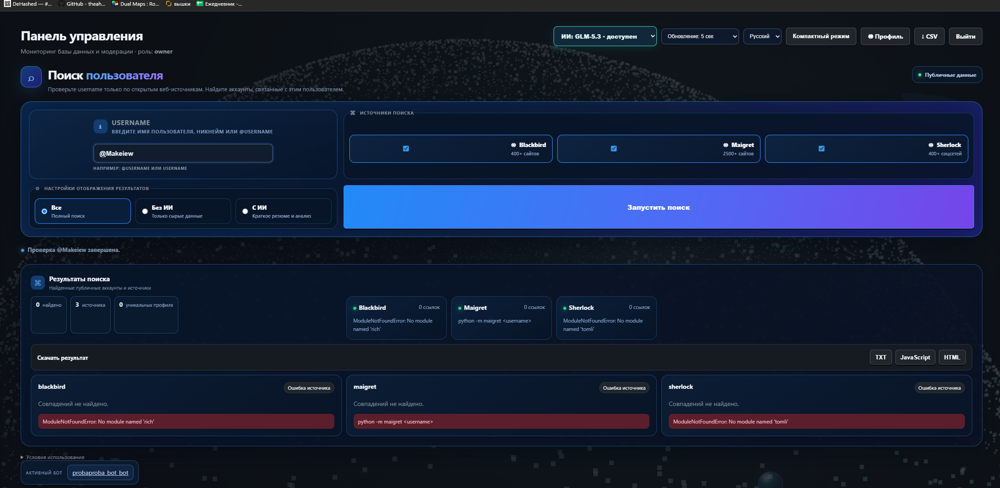
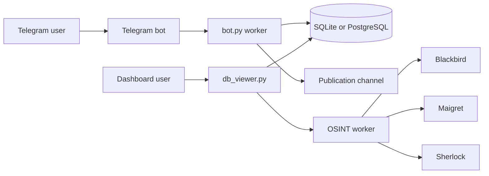

# Podslushka DB

Podslushka DB is a Telegram moderation dashboard with a local SQLite mode and
production PostgreSQL support. It manages users, submissions, moderation,
managed bots, audit events, backups and public username searches.

## Product overview

- Dashboard for users, posts, reports, bans and moderation events.
- Roles: `owner`, `admin`, `moderator`, `read-only` and `user`.
- Multiple managed Telegram bots with isolated data scopes.
- PostgreSQL on Render and SQLite for local development.
- Session authentication, optional OAuth, 2FA and audit logging.
- Telegram worker with background processing and publication to a channel.
- AI moderation integrations for Gemini, Qwen, DeepSeek and GLM.
- Responsive dark dashboard with theme gallery, compact mode and language
  selector.
- Branded error pages for common HTTP failures.

## OSINT username search

The **Search users** page checks a username only against public web sources.
The available tools are:

- **Blackbird** — broad public-site search.
- **Maigret** — public username search across thousands of sites.
- **Sherlock** — public social-profile search.

Search jobs run in the background and update progressively. Each source has
its own state: checking, completed, timeout or error. One failed source does
not hide successful results from the other sources.

Results can be downloaded as:

- TXT;
- JavaScript;
- HTML.

The optional AI mode receives public result URLs for a short summary. It does
not prove identity, access private accounts, bypass CAPTCHA or collect
passwords.

### OSINT interface



The interface contains:

1. Username input.
2. Independent source selection for Blackbird, Maigret and Sherlock.
3. Display modes: all results, raw results or AI summary.
4. Progressive source cards and aggregate statistics.
5. Export buttons for TXT, JavaScript and HTML.

### Legal and privacy notice

Use the search only for lawful, authorised research. Results may be incomplete
or incorrect and must not be treated as proof that a username belongs to a
specific person.

## Screenshots

| Public landing page | Dashboard |
| --- | --- |
|  |  |

| About page | Support page |
| --- | --- |
|  |  |

| Error page |
| --- |
|  |

## Architecture



## Repository structure

| File or directory | Purpose |
| --- | --- |
| `db_viewer.py` | HTTP dashboard, authentication, pages and dashboard APIs |
| `bot.py` | Telegram handlers, moderation and notifications |
| `db.py` | Database access and migrations |
| `config.py` | Telegram worker configuration |
| `i18n.py` | Telegram bot translations |
| `osint_search.py` | Validated background OSINT jobs and result normalisation |
| `render.yaml` | Render build, start and environment configuration |
| `site_monitor.py` | Availability monitor |
| `tools/` | Downloaded Blackbird, Maigret and Sherlock repositories |
| `assets/screenshots/` | README preview screenshots |

## Local Windows setup

Open PowerShell in the project directory:

```powershell
python -m venv venv
.\venv\Scripts\python.exe -m pip install -r requirements.txt
.\venv\Scripts\python.exe db_viewer.py
```

The dashboard starts at `http://127.0.0.1:8765/`.

For local development, create `.env`:

```env
BOT_TOKEN=your_telegram_bot_token
ADMIN_IDS=123456789
CHANNEL_ID=@your_channel
OWNER_USERNAME=owner
OWNER_PASSWORD=use-a-strong-password
```

Without `DATABASE_URL`, the application uses `podslushka.db`.

## Render deployment

The Render service:

1. Installs the dashboard and OSINT dependencies from `requirements.txt`.
2. Downloads Blackbird, Maigret and Sherlock into `tools/`.
3. Starts `db_viewer.py`.

Required production variables:

| Variable | Purpose |
| --- | --- |
| `DATABASE_URL` | Render PostgreSQL internal URL |
| `OWNER_USERNAME` | Dashboard owner login |
| `OWNER_PASSWORD` | Dashboard owner password |
| `BOT_TOKEN` | Telegram bot token |
| `ADMIN_IDS` | Global administrator IDs |
| `CHANNEL_ID` | Publication channel |
| `OWNER_TELEGRAM_ID` | Owner notification recipient |
| `DASHBOARD_SYNC_SECRET` | Worker-to-dashboard authentication |
| `MULTIBOT_ENCRYPTION_KEY` | Fernet key for managed bot tokens |

Optional variables include `GEMINI_API_KEY`, `HF_TOKEN`, `HF_MODEL`,
`DEEPSEEK_MODEL`, `GLM_MODEL`, `AI_PROVIDER`, OAuth variables, 2FA settings
and `SITE_MAINTENANCE_MODE`.

The public deployment is:

<https://podslushka-dashboard.onrender.com/>

## AI providers

Gemini:

```env
AI_PROVIDER=gemini
GEMINI_API_KEY=...
GEMINI_MODEL=gemini-3-flash-preview
```

Hugging Face providers:

```env
HF_TOKEN=hf_...
AI_PROVIDER=qwen
HF_MODEL=Qwen/Qwen3.8-27B
```

The token is stored only in environment variables. Never commit secrets to
GitHub or put them in README files.

## Validation

Run the basic checks before publishing:

```powershell
.\venv\Scripts\python.exe -m py_compile db_viewer.py osint_search.py
git diff --check
```

To verify the local service:

```powershell
Invoke-WebRequest http://127.0.0.1:8765/
```

## Source size

The current application contains **9,191 lines** across 12 source files,
excluding `venv`, downloaded third-party repositories in `tools` and `.git`.
Python files account for **8,966 lines**:

| File | Lines |
| --- | ---: |
| `db_viewer.py` | 5,768 |
| `bot.py` | 1,436 |
| `db.py` | 1,090 |
| `osint_search.py` | 312 |
| Other Python files | 360 |

## License and third-party tools

The application code is maintained in this repository. Blackbird, Maigret and
Sherlock are downloaded from their public repositories during deployment and
remain subject to their respective licenses and terms.
