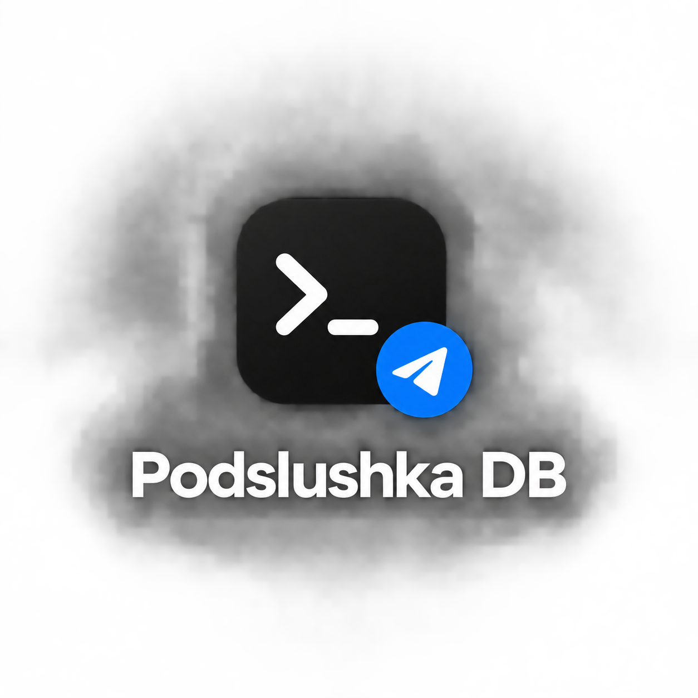
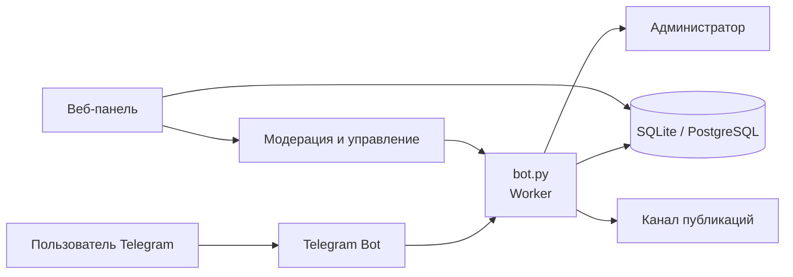
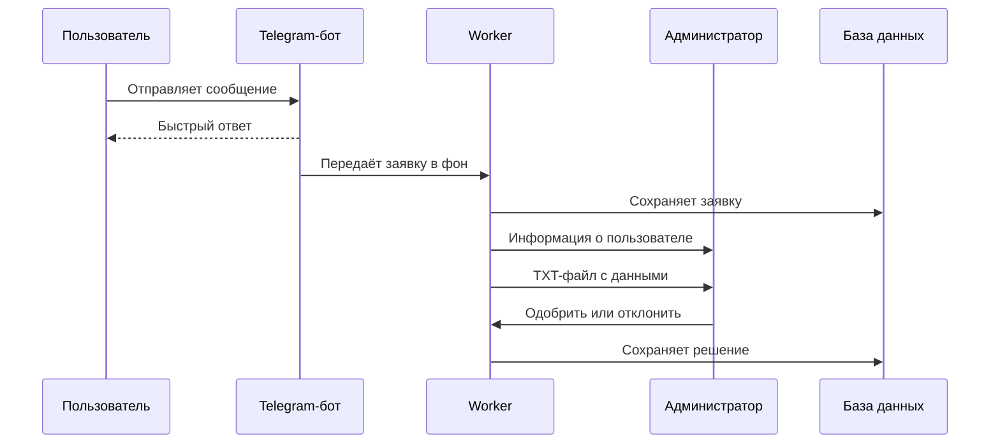
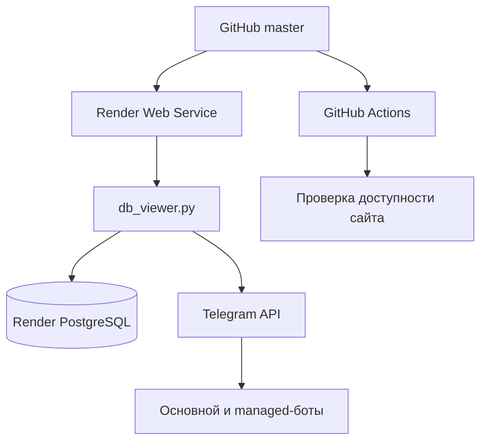

# Podslushka DB

<p align="center">
  
</p>

<p align="center">
  Панель управления Telegram-ботами, заявками и модерацией
</p>

<p align="center">
  <a href="https://podslushka-dashboard.onrender.com/">Открыть панель</a>
  ·
  <a href="https://github.com/makeiew-osint/podslushka-dashboard/issues">Сообщить о проблеме</a>
</p>

Podslushka DB — панель управления Telegram-ботами, заявками и модерацией.
Проект включает веб-панель, Telegram worker, поддержку нескольких managed-ботов,
изоляцию данных между ботами и публикацию одобренных материалов в канал.

## Как устроен проект



## Основной сценарий



## Возможности

- Dashboard с пользователями, заявками, публикациями, жалобами и событиями.
- Роли `owner`, `admin`, `moderator`, `read-only` и `user`.
- Создание проектов и подключение нескольких Telegram-ботов.
- Отдельные администраторы для каждого managed-бота.
- Изоляция заявок, пользователей, банов, слов и статистики по `bot_id`.
- Зашифрованное хранение токенов подключённых ботов.
- Ручная модерация и осторожная AI-автомодерация с порогом уверенности.
- Отправка администратору данных отправителя и отдельного `.txt`-файла с отчётом.
- Быстрый ответ пользователю до фоновой обработки заявки.
- Публикация одобренных материалов в Telegram-канал.
- Мониторинг worker-процессов, Telegram-соединения и состояния базы.
- Профиль с темами, аватаром, языком, сессиями, журналом входов и 2FA QR.
- Резервное копирование, CSV-экспорт и журнал действий.
- Branded-страницы ошибок `400/401/403/404/500/502/503` в стиле GitHub.
- Локальный запуск через SQLite или production-запуск через PostgreSQL.

## Структура

| Файл | Назначение |
| --- | --- |
| `db_viewer.py` | HTTP-панель, авторизация, профиль, API и supervisor |
| `bot.py` | Telegram handlers, заявки, уведомления и модерация |
| `db.py` | Асинхронный слой SQLite/PostgreSQL |
| `config.py` | Настройки Telegram worker |
| `i18n.py` | Локализация Telegram-бота |
| `render.yaml` | Конфигурация Render |
| `site_monitor.py` | Проверка доступности сайта |
| `.github/workflows/site-monitor.yml` | Мониторинг сайта каждые 5 минут |

## Архитектура деплоя



<p align="center">
  
</p>

## Локальный запуск Windows

Откройте PowerShell в папке проекта:

```powershell
python -m venv venv
.\venv\Scripts\python.exe -m pip install -r requirements.txt
.\venv\Scripts\python.exe db_viewer.py
```

Панель будет доступна по адресу `http://127.0.0.1:8765/`.

Для локального запуска создайте `.env`. Минимальный набор:

```env
BOT_TOKEN=токен_бота
ADMIN_IDS=123456789,987654321
CHANNEL_ID=@имя_канала
OWNER_USERNAME=owner
OWNER_PASSWORD=сильный_пароль
```

При локальном запуске без `DATABASE_URL` используется файл `podslushka.db`.

## Деплой на Render

`render.yaml` создаёт один web-service:

```text
build: pip install -r requirements.txt
start: python db_viewer.py
```

На Render обязательно настройте:

| Переменная | Назначение |
| --- | --- |
| `DATABASE_URL` | Internal Database URL подключённой Render PostgreSQL |
| `OWNER_USERNAME` | Логин владельца панели |
| `OWNER_PASSWORD` | Пароль владельца |
| `BOT_TOKEN` | Токен основного Telegram-бота |
| `ADMIN_IDS` | Telegram ID глобальных администраторов через запятую |
| `OWNER_TELEGRAM_ID` | Telegram ID владельца для получения уведомлений от всех ботов |
| `CHANNEL_ID` | `@username` канала или числовой ID `-100...` |
| `MULTIBOT_ENCRYPTION_KEY` | Fernet-ключ для токенов managed-ботов |
| `DASHBOARD_SYNC_SECRET` | Секрет синхронизации worker с dashboard |
| `DASHBOARD_SYNC_URL` | URL dashboard, например `https://podslushka-dashboard.onrender.com` |

Дополнительные настройки: `GEMINI_API_KEY`, `GEMINI_MODEL`, `HF_TOKEN`,
`HF_MODEL`, `DEEPSEEK_MODEL` и `AI_PROVIDER`,
`TELEGRAM_BOT_USERNAME`, `TELEGRAM_UPDATES_CHAT_ID`, `OAUTH_BASE_URL`,
`OAUTH_SIGNING_SECRET`, `GOOGLE_CLIENT_ID`, `GOOGLE_CLIENT_SECRET`,
`OWNER_2FA_SECRET`, `OWNER_2FA_REQUIRED` и `SITE_MAINTENANCE_MODE`.

### AI-провайдеры

По умолчанию используется Gemini:

```env
AI_PROVIDER=gemini
GEMINI_API_KEY=...
GEMINI_MODEL=gemini-3-flash-preview
```

Для Qwen через Hugging Face Inference API укажите в Render:

```env
AI_PROVIDER=qwen
HF_TOKEN=hf_...
HF_MODEL=Qwen/Qwen3.8-27B
```

`HF_TOKEN` создаётся в настройках Hugging Face с правом `Read`. Токен нельзя
добавлять в Git, README или отправлять в чат. Модель не клонируется на Render:
запросы идут через Hugging Face Router, поэтому не требуется скачивать десятки
гигабайт весов на бесплатный web-service.

Для DeepSeek через тот же Hugging Face Router выберите `DeepSeek` в панели:

```env
AI_PROVIDER=deepseek
HF_TOKEN=hf_...
DEEPSEEK_MODEL=deepseek-ai/DeepSeek-V4.1-Flash
```

Qwen и DeepSeek используют один `HF_TOKEN`, но разные модели. В интерфейсе
панели можно переключать Gemini, Qwen и DeepSeek перед запуском анализа.

Для получения сообщений от всех managed-ботов укажите числовой Telegram ID
владельца в `OWNER_TELEGRAM_ID`. Бот отправляет владельцу те же уведомления,
что и назначенным администраторам, а доступ к этим отправкам остаётся виден в
операционном журнале.

### Важно про `DATABASE_URL`

Не копируйте старый URL базы вручную. Если в логах появляется:

```text
failed to resolve host
PostgreSQL did not release a connection slot during startup
```

откройте **Render → Web Service → Environment** и заново добавьте
`DATABASE_URL` через **Add from database → Internal Database URL**. Затем
проверьте, что PostgreSQL имеет статус `Available`, сохраните переменную и
запустите **Manual Deploy → Deploy latest commit**.

На бесплатном Render-инстансе сервис засыпает после простоя. Первый запрос после
сна может занимать около минуты. Выключение компьютера не должно останавливать
Render-сервис; если появляется `502`, проверяйте статус сервиса и логи деплоя.

## Страница ошибок

Приложение использует собственную страницу ошибок вместо стандартного ответа
браузера. Она показывает код и понятное описание проблемы, а также кнопки
**Повторить** и **На главную**. Для проверки 404 откройте любой несуществующий
адрес:

```text
https://podslushka-dashboard.onrender.com/nonexistent-page
```

Если сам Render-инстанс полностью остановлен или деплой не запущен, страницу
приложения показать невозможно: в этом случае Render отображает собственную
страницу `502`. Сначала восстановите статус сервиса `Live`.

## Telegram-бот и администраторы

1. Создайте бота через `@BotFather`.
2. Добавьте его администратором канала с правом публикации.
3. Укажите `CHANNEL_ID`.
4. Для каждого администратора укажите числовой Telegram ID в панели.
5. Каждый администратор должен открыть конкретного бота и один раз отправить
   `/start`: Telegram запрещает боту первым писать пользователю.

Для managed-бота уведомления получают владелец и администраторы, указанные для
этого бота. При новой заявке отправляются обычное сообщение с информацией о
пользователе и отдельный UTF-8 `.txt`-файл. Если база временно недоступна,
worker пытается отправить резервное уведомление без данных из базы.

## AI-модерация

AI включается отдельно для managed-бота. Автопубликация выполняется только при
валидном ответе модели, `publish=true` и достижении порога уверенности. При
ошибке, сомнительном содержимом или prompt injection заявка остаётся на ручной
проверке.

## Профиль и безопасность

В профиле доступны:

- имя, email, язык и URL аватара;
- выбор темы интерфейса;
- активные сессии и выход с других устройств;
- журнал входов;
- настройка и отключение 2FA через QR-код;
- смена пароля.

Токены ботов не показываются в интерфейсе и хранятся в зашифрованном виде.
Owner-режим проверки администратора заметен в интерфейсе, записывается в журнал
и блокирует опасные операции.

## Мониторинг

Workflow `Monitor Podslushka DB` запускается каждые пять минут. Для GitHub
Actions добавьте Secrets:

```text
BOT_TOKEN
TELEGRAM_UPDATES_CHAT_ID
```

Опционально задайте Repository Variable `SITE_URL`. Монитор отправляет
уведомление при переходе `online -> offline` и сообщение о восстановлении при
переходе `offline -> online`.

## Проверка перед публикацией

```powershell
python -m py_compile db_viewer.py db.py bot.py site_monitor.py
git diff --check
```

Не добавляйте в Git `.env`, токены, пароли, Fernet-ключи и базы с реальными
данными.
