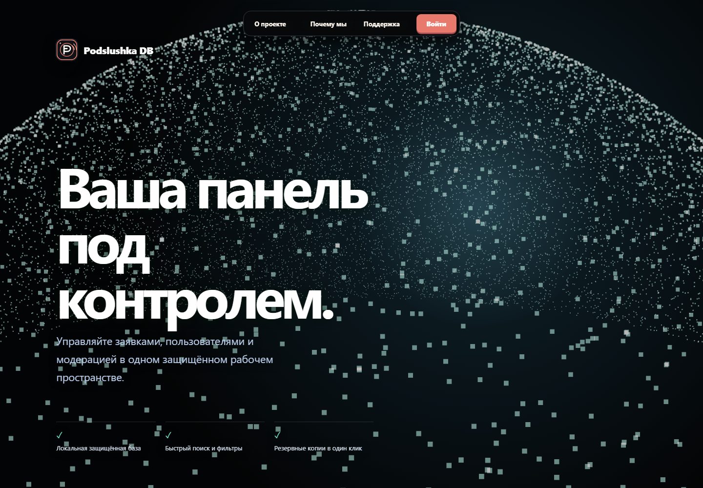
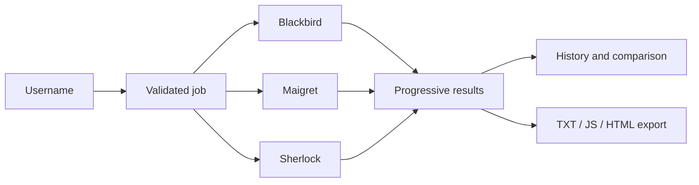
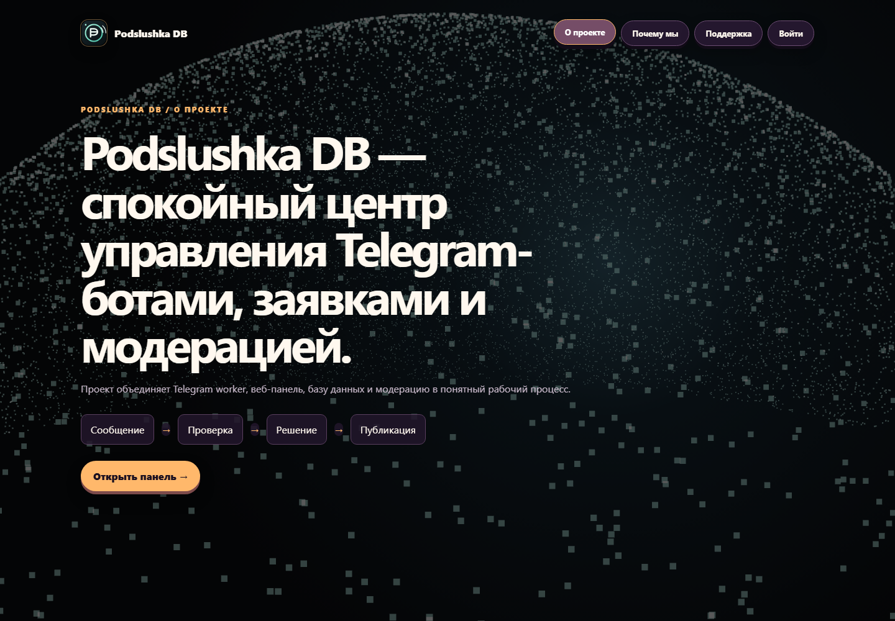
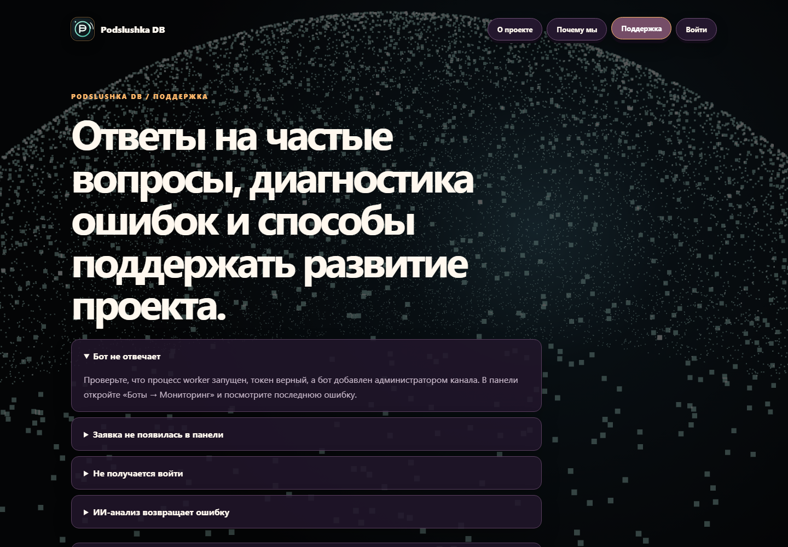
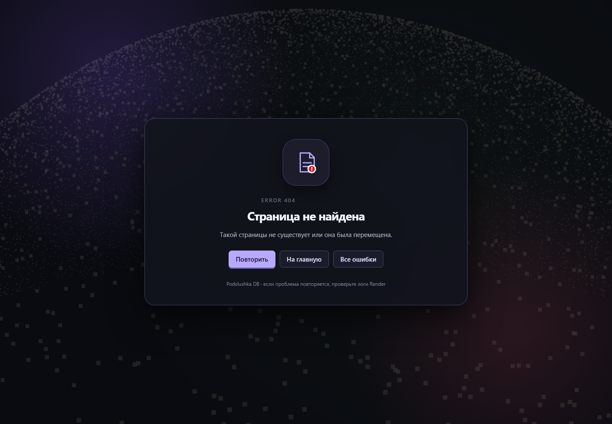

<div align="center">


# Podslushka DB

### Private Telegram moderation and OSINT workspace

Securely moderate Telegram submissions, operate multiple bots and investigate
public usernames from one focused dashboard.

<p>
  <a href="https://podslushka-dashboard.onrender.com/"><strong>Open the live dashboard</strong></a>
  ·
  <a href="#quick-start">Quick start</a>
  ·
  <a href="#documentation">Documentation</a>
</p>

<p>
  
  
  
  
</p>

</div>

<br>

<div align="center">
  
</div>

## What it is

Podslushka DB is a private operations dashboard for Telegram communities. It
combines moderation, bot operations, auditability and public-source username
search in one deployable Python application.

It is built for owners and moderators who need to move from **incoming message**
to **reviewed decision** to **auditable action** without switching between
several tools.

## Highlights

| Moderation | Bot operations | OSINT workspace |
| --- | --- | --- |
| Review queue, reports, bans and publication flow | Multiple managed bots with isolated scopes | Blackbird, Maigret and Sherlock |
| Roles and permissions | Worker health and status | Progressive results and per-source timeouts |
| Audit events and backups | Telegram notifications | History, retries, comparisons and exports |

### Built-in capabilities

- **Dashboard** — users, submissions, reports, health, access and activity.
- **Authentication** — owner/admin/moderator/read-only roles, sessions, optional
  OAuth and optional 2FA.
- **Telegram worker** — background processing, moderation actions and channel
  publication.
- **OSINT search** — public username checks with partial-result recovery,
  source statuses and a global watchdog so jobs do not hang forever.
- **Search history** — repeat a check, delete snapshots, compare two checks and
  see new, removed or changed profiles.
- **Exports and quick actions** — TXT, JavaScript and HTML reports, copy links,
  open results and retry failed sources.
- **AI moderation** — Gemini, Qwen, DeepSeek and GLM integrations, guarded by
  environment variables and an explicit maintenance mode.
- **Responsive UI** — mobile navigation, touch-friendly controls, theme
  gallery, compact mode and branded error states.

## OSINT search flow



Every source runs independently. A timeout or outage in one tool does not erase
successful results from the others. Completed snapshots are persisted so the
history remains useful after a web-process restart.

> **Responsible use:** the OSINT module checks public web sources only. It does
> not prove identity, access private accounts, bypass CAPTCHA or collect
> passwords. Use it only for lawful, authorised research.

## Screenshots

<div align="center">
  <table>
    <tr>
      <td></td>
      <td></td>
    </tr>
    <tr>
      <td></td>
      <td></td>
    </tr>
  </table>
</div>

## Quick start

### Windows

Open PowerShell in the project directory:

```powershell
python -m venv venv
.\venv\Scripts\python.exe -m pip install -r requirements.txt
.\venv\Scripts\python.exe db_viewer.py
```

Open <http://127.0.0.1:8765/>.

If the project was moved to another drive, recreate the virtual environment
instead of copying it. Windows virtual environments contain absolute launcher
paths:

```powershell
Remove-Item -Recurse -Force .\venv
python -m venv venv
.\venv\Scripts\python.exe -m pip install -r requirements.txt
```

### Environment

Create a local `.env` file. It is ignored by Git:

```env
BOT_TOKEN=your_telegram_bot_token
ADMIN_IDS=123456789
CHANNEL_ID=@your_channel
OWNER_USERNAME=owner
OWNER_PASSWORD=use-a-long-unique-password
```

Without `DATABASE_URL`, the app uses local `podslushka.db`. Production should
use PostgreSQL.

## Deploy on Render

The included `render.yaml`:

1. Installs Python dependencies.
2. Downloads Blackbird, Maigret and Sherlock.
3. Installs the OSINT tools.
4. Copies the bundled Maigret settings.
5. Starts the dashboard with `python db_viewer.py`.

Set these required variables in Render:

| Variable | Purpose |
| --- | --- |
| `DATABASE_URL` | PostgreSQL connection string |
| `OWNER_USERNAME` | Dashboard owner login |
| `OWNER_PASSWORD` | Dashboard owner password |
| `BOT_TOKEN` | Telegram bot token |
| `ADMIN_IDS` | Global administrator IDs |
| `CHANNEL_ID` | Publication channel |
| `DASHBOARD_SYNC_SECRET` | Worker-to-dashboard authentication |
| `MULTIBOT_ENCRYPTION_KEY` | Encryption key for managed bot tokens |

Useful optional variables:

| Variable | Purpose |
| --- | --- |
| `GEMINI_API_KEY` | Gemini moderation |
| `GEMINI_MODEL` | Gemini model name |
| `HF_TOKEN` | Hugging Face providers |
| `AI_PROVIDER` | Default AI provider |
| `AI_MAINTENANCE_MODE` | Disable all AI controls during provider outages |
| `SITE_MAINTENANCE_MODE` | Show maintenance state in notifications |
| `OSINT_*_TIMEOUT` | Tune source and job timeouts |

Live deployment: <https://podslushka-dashboard.onrender.com/>

## Documentation

| Guide | Contents |
| --- | --- |
| [`WEBSITE_GUIDE_EN.txt`](WEBSITE_GUIDE_EN.txt) | Dashboard and website guide |
| [`BOT_GUIDE_EN.txt`](BOT_GUIDE_EN.txt) | Telegram bot guide |
| [`ИНСТРУКЦИЯ_САЙТ_RU.txt`](ИНСТРУКЦИЯ_САЙТ_RU.txt) | Russian website guide |
| [`ИНСТРУКЦИЯ_БОТ_RU.txt`](ИНСТРУКЦИЯ_БОТ_RU.txt) | Russian bot guide |
| [`render.yaml`](render.yaml) | Deployment and environment blueprint |

## Repository map

| Path | Responsibility |
| --- | --- |
| `db_viewer.py` | HTTP dashboard, authentication, pages and APIs |
| `bot.py` | Telegram handlers, moderation and notifications |
| `db.py` | Database access, schema and migrations |
| `osint_search.py` | Validated background OSINT jobs and normalisation |
| `site_monitor.py` | Scheduled availability monitor |
| `render.yaml` | Render build, start and environment configuration |
| `assets/` | Product artwork and dashboard visual assets |
| `.github/` | Workflows, issue forms and contribution templates |

## Development checks

Run the smallest useful checks before publishing:

```powershell
.\venv\Scripts\python.exe -m py_compile db_viewer.py osint_search.py site_monitor.py
git diff --check
```

Local HTTP smoke check:

```powershell
Invoke-WebRequest http://127.0.0.1:8765/
```

## Security and privacy

- Never commit `.env`, API keys, bot tokens, database dumps or production
  credentials.
- Use a unique owner password and a strong `DASHBOARD_SYNC_SECRET`.
- Keep `MULTIBOT_ENCRYPTION_KEY` stable; changing it makes stored bot tokens
  unreadable.
- Treat OSINT results as leads, not proof of identity.
- Report vulnerabilities privately using [`SECURITY.md`](SECURITY.md).

## License and third-party tools

Application code is maintained in this repository. Blackbird, Maigret and
Sherlock are downloaded from their public repositories during deployment and
remain subject to their own licenses and terms.

<div align="center">

<br>

**Podslushka DB · operate clearly, moderate responsibly**

</div>
